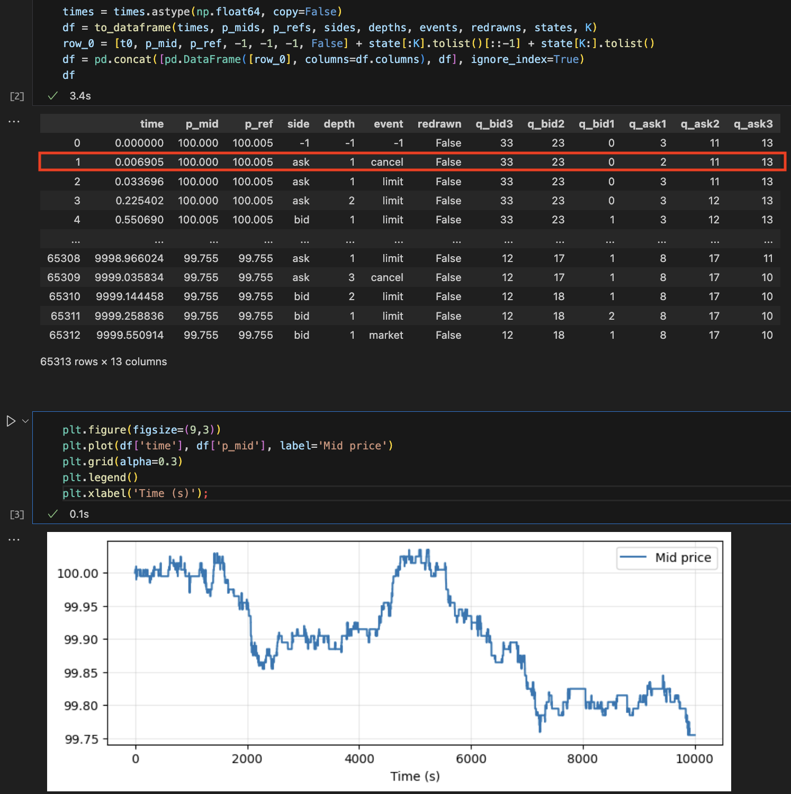

# RL for Optimal Execution in Queue-Reactive Models

Code used in our paper: [](https://arxiv.org/abs/2511.15262) T. Espana, Y. Hafsi, F. Lillo, E. Vittori (2025).

## 📄 Abstract

We investigate the use of Reinforcement Learning for the optimal execution of meta-orders, where the objective is to execute incrementally large orders while minimizing implementation shortfall and market impact over an extended period of time. Departing from traditional parametric approaches to price dynamics and impact modeling, we adopt a model-free, data-driven framework. Since policy optimization requires counterfactual feedback that historical data cannot provide, we employ the Queue-Reactive Model to generate realistic and tractable limit order book simulations that encompass transient price impact, and nonlinear and dynamic order flow responses. Methodologically, we train a Double Deep Q-Network agent on a state space comprising time, inventory, price, and depth variables, and evaluate its performance against established benchmarks. Numerical simulation results show that the agent learns a policy that is both strategic and tactical, adapting effectively to order book conditions and outperforming standard approaches across multiple training configurations. These findings provide strong evidence that model-free Reinforcement Learning can yield adaptive and robust solutions to the optimal execution problem.

## 🚀 Setup Instructions

### 1. Clone the repo

```bash
git clone https://github.com/espanato/qrm_optimal_execution.git
cd qrm_optimal_execution
```

### 2. Virtual env and dependencies

```bash
python -m venv .venv
# macOS / Linux
source .venv/bin/activate
# Windows (PowerShell)
# .\.venv\Scripts\activate
python -m pip install --upgrade pip
pip install -r requirements.txt
python -m pip install -e .
```

### 3. See the quick guide below and have fun!


## 📊 The Queue-Reactive Model 

The implemented Queue-Reactive Model corresponds to Model I of the paper: [](https://arxiv.org/abs/1312.0563)

See `notebooks/main.ipynb` (Section I) for a step-by-step walkthrough of running QRM LOB simulations, as illustrated below.

<p align="center">
  
</p>

### Event log (DataFrame) — how to read it

Each row is **one LOB event** generated by the Queue-Reactive Model (QRM), together with the **state of the book *after* applying the event**.

**Columns**
- `time`: event time (in seconds) since the start of the simulation.
- `p_mid`: mid-price at that time.
- `p_ref`: reference price used by the QRM state (may differ slightly from `p_mid` depending on conventions).
- `side`: which side the event acts on (`bid` / `ask`).
- `depth`: price level **relative to the best** on that side (`1` = best bid/ask, `2` = second level, …).
- `event`: event type (e.g. `limit`, `cancel`, `market`).
- `redrawn`: whether the reference frame / state was reset due to a price move (implementation-dependent; typically `True` when the reference changes and queues are re-initialized).

**Queue sizes (state)**
- `q_bid1`, `q_bid2`, `q_bid3`: sizes of the bid queues at depths 1/2/3 (best bid, 2nd bid, 3rd bid).
- `q_ask1`, `q_ask2`, `q_ask3`: sizes of the ask queues at depths 1/2/3 (best ask, 2nd ask, 3rd ask).

**Example (highlighted row)**
In the red-highlighted row, we have an `ask` **cancel** at `depth = 1` (best ask) occurring at `time = 0.006905`.
You can verify its effect by comparing the queue sizes with the previous row: `q_ask1` decreases from `3` to `2`, while other queues (and prices) remain unchanged.